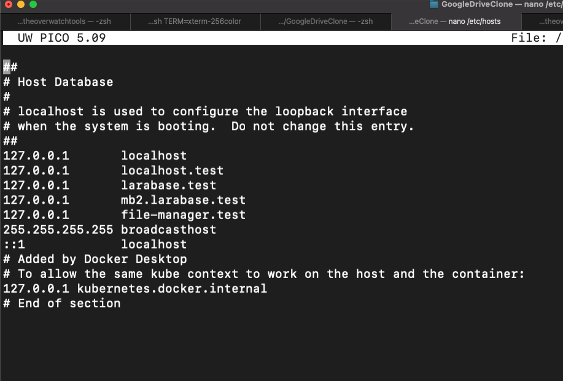

## Installation instructions

Most of these instructions are written with the context of using a MAC,
sorry _Windows_ users.

### Prerequisites
1. Make sure your APP_URL is in sync with your /etc/hosts

How to start on your local machine
1. ./vendor/bin/sail up
2. execute **php artisan migrate:refresh --seed**
3. execute **composer install**
4. execute **npm install**
5. to login, goto APP_URL/login, and type your login credentials (the login credentials are in your seeder)
